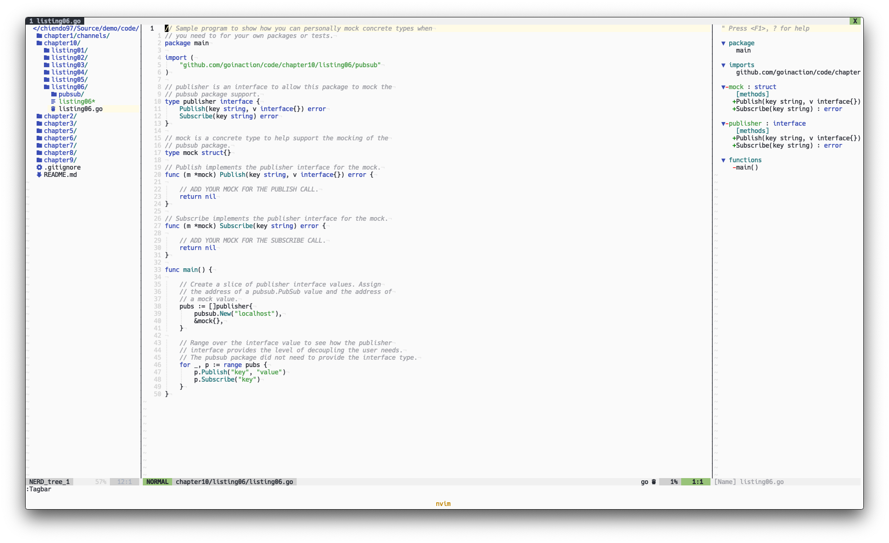

# Light IntelliJ Theme for vim

Light vim colorscheme, is built based on light IntelliJ default theme.



## Features
- Light color schemes.
- Support first for GoLang.

## Screenshots
You guys can see all screenshots in the [screenshots folder](./screenshots).

## Installation & Usage
### Neovim
Install with [vim-plug](https://github.com/junegunn/vim-plug) then set `colorscheme` and `g:lightline.colorscheme`:

```vim
    Plug 'chiendo97/intellij.vim'
    set background=light
    colorscheme intellij
    let g:lightline.colorscheme='intellij'
```

Note: you must enable true colors in (neo)vim.

## Contributing
All contributions are welcome. I'd love to review all of them.
